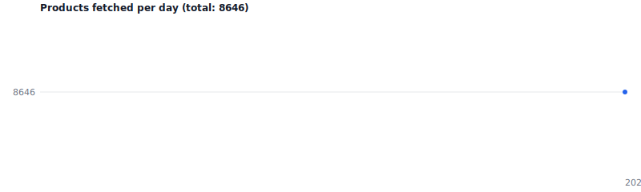

# posokanei-archive



Daily archival snapshots of all products and prices from the Greek price
observatory **[posokanei.gov.gr](https://posokanei.gov.gr)** (Παρατηρητήριο
Τιμών), fetched from its public API.

A GitHub Action runs once a day, downloads the full catalogue (~8,600 products
with per-retailer prices), and commits a snapshot. The growing series of
snapshots forms a historical price record.

## Layout

```
data/
  latest.json                   # pointer to the newest snapshot
  history.csv                   # date,total,collected — one row per day
  2026/
    posokanei-2026-06-22.json   # one JSON snapshot per day
assets/
  products.svg                  # daily-regenerated chart (shown above)
```

Snapshots are stored as **plain, pretty-printed JSON** with products sorted by
`id` and stable key order. Each working-tree file is ~20 MB, but because
consecutive days are nearly identical line-for-line, git's delta compression
stores each new day as a small delta — keeping repository growth modest
(typically well under 1 MB of pack growth per day).

Each snapshot is a single JSON object:

| field        | description                                              |
|--------------|----------------------------------------------------------|
| `date`       | snapshot date (UTC)                                      |
| `fetched_at` | UTC timestamp of the crawl                               |
| `total`      | product count reported by the API                        |
| `retailers`  | `/meta/retailers?countries=all`                          |
| `categories` | `/meta/categories`                                       |
| `products`   | every product, all pages merged — incl. `retailer_prices` and `price_stats` |

## Reading a snapshot

```bash
jq '.total' data/2026/posokanei-2026-06-22.json
```

```python
import json
with open("data/2026/posokanei-2026-06-22.json", encoding="utf-8") as f:
    snap = json.load(f)
print(snap["total"], "products")
```

## Running locally

```bash
python fetch.py        # writes today's snapshot under data/
```

Standard library only — no dependencies.

## Source

The product listing endpoint already embeds per-retailer prices, so one
paginated crawl (`/products?countries=all`, `page_size=100`) captures the full
price picture without hitting per-product endpoints. Data © the operators of
posokanei.gov.gr; archived here for research/preservation.
