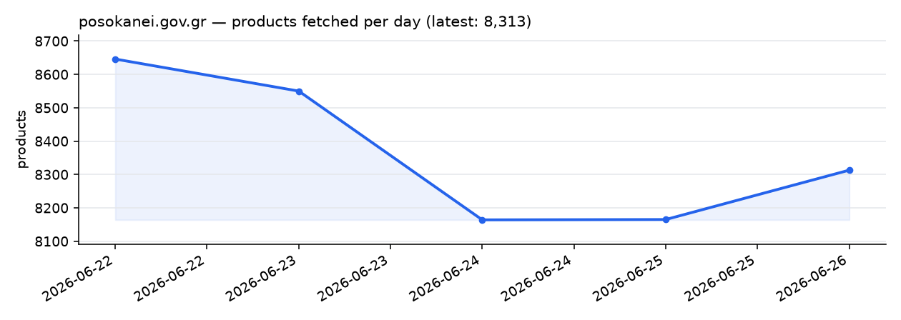

# posokanei-archive



Καθημερινά αρχειακά στιγμιότυπα όλων των προϊόντων και των τιμών από το ελληνικό
Παρατηρητήριο Τιμών **[posokanei.gov.gr](https://posokanei.gov.gr)**, μέσω του
δημόσιου API του.

Ένα GitHub Action τρέχει μία φορά την ημέρα, κατεβάζει ολόκληρο τον κατάλογο
(~8.600 προϊόντα με τιμές ανά αλυσίδα) και αποθηκεύει ένα στιγμιότυπο. Η σειρά
των στιγμιότυπων που μεγαλώνει σχηματίζει ένα ιστορικό αρχείο τιμών.

**👉 Δες το [STATS.md](STATS.md) για καθημερινά στατιστικά** — οι μεγαλύτερες
διαφορές τιμής μεταξύ σούπερ μάρκετ, η κατάταξη του φθηνότερου, η οικονομία από
τα προϊόντα ιδιωτικής ετικέτας και η σύγκριση Ελλάδας-Ευρώπης.

## Δομή

```
data/
  latest.json                   # δείκτης προς το νεότερο στιγμιότυπο
  history.csv                   # date,total,collected — μία γραμμή ανά ημέρα
  2026/
    posokanei-2026-06-22.json   # ένα JSON στιγμιότυπο ανά ημέρα
assets/
  products.png                  # γράφημα που ανανεώνεται καθημερινά (πιο πάνω)
STATS.md                        # στατιστικά τιμών που ανανεώνονται καθημερινά
```

Τα στιγμιότυπα αποθηκεύονται ως **απλό, μορφοποιημένο JSON** με τα προϊόντα
ταξινομημένα κατά `id` και σταθερή σειρά κλειδιών. Κάθε αρχείο είναι ~20 MB, αλλά
επειδή οι διαδοχικές ημέρες είναι σχεδόν πανομοιότυπες γραμμή προς γραμμή, η
συμπίεση delta του git αποθηκεύει κάθε νέα ημέρα ως μικρή διαφορά — κρατώντας την
αύξηση του αποθετηρίου μικρή (συνήθως αρκετά κάτω από 1 MB ανά ημέρα).

Κάθε στιγμιότυπο είναι ένα JSON αντικείμενο:

| πεδίο        | περιγραφή                                                |
|--------------|----------------------------------------------------------|
| `date`       | ημερομηνία στιγμιότυπου (UTC)                            |
| `fetched_at` | χρονοσφραγίδα UTC της λήψης                              |
| `total`      | πλήθος προϊόντων όπως το αναφέρει το API                 |
| `retailers`  | `/meta/retailers?countries=all`                          |
| `categories` | `/meta/categories`                                       |
| `products`   | όλα τα προϊόντα, όλες οι σελίδες ενωμένες — μαζί με `retailer_prices` και `price_stats` |

## Διάβασμα ενός στιγμιότυπου

```bash
jq '.total' data/2026/posokanei-2026-06-22.json
```

```python
import json
with open("data/2026/posokanei-2026-06-22.json", encoding="utf-8") as f:
    snap = json.load(f)
print(snap["total"], "προϊόντα")
```

## Τοπική εκτέλεση

```bash
python fetch.py                       # γράφει το σημερινό στιγμιότυπο + ενημερώνει το data/history.csv
pip install -r requirements.txt       # χρειάζεται μόνο για το γράφημα
python chart.py                       # ξαναφτιάχνει το assets/products.png από το history.csv
python stats.py                       # ξαναφτιάχνει το STATS.md από το νεότερο στιγμιότυπο
```

Το `fetch.py` χρησιμοποιεί μόνο τη standard library. Το `chart.py` χρειάζεται το
matplotlib (η μοναδική εξάρτηση), που κρατιέται ξεχωριστά ώστε ο crawler να μένει
χωρίς εξαρτήσεις. Το `stats.py` είναι επίσης μόνο standard library.

## Πηγή

Το endpoint της λίστας προϊόντων ενσωματώνει ήδη τις τιμές ανά αλυσίδα, οπότε μία
σελιδοποιημένη λήψη (`/products?countries=all`, `page_size=100`) καταγράφει
ολόκληρη την εικόνα των τιμών χωρίς κλήσεις ανά προϊόν. Δεδομένα © οι φορείς του
posokanei.gov.gr· αρχειοθετούνται εδώ για έρευνα/διατήρηση.
