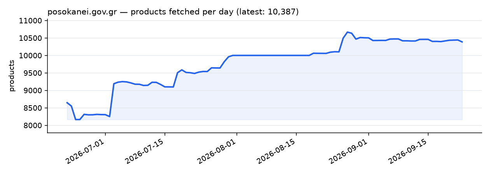

# posokanei



Καθημερινά αρχειακά στιγμιότυπα όλων των προϊόντων και των τιμών από το ελληνικό
Παρατηρητήριο Τιμών **[posokanei.gov.gr](https://posokanei.gov.gr)**, μέσω του
δημόσιου API του.

Τα στιγμιότυπα συλλέγονται καθημερινά από ξεχωριστό ιδιωτικό σύστημα και
δημοσιεύονται εδώ μαζί με τα γραφήματα και την αναφορά. Η ακριβής ώρα λήψης
καταγράφεται στο `fetched_at` κάθε στιγμιότυπου. Η σειρά των στιγμιότυπων
σχηματίζει ένα ιστορικό αρχείο τιμών.

**👉 Δες τα καθημερινά στατιστικά ως κομψή, έτοιμη για εκτύπωση/PDF αναφορά:
👉 https://spyrosavl.github.io/posokanei/** (ανανεώνεται καθημερινά) — οι
μεγαλύτερες διαφορές τιμής μεταξύ σούπερ μάρκετ, η κατάταξη του φθηνότερου, η
οικονομία από τα προϊόντα ιδιωτικής ετικέτας και η σύγκριση Ελλάδας-Ευρώπης.

## Δομή

```
data/
  latest.json                   # δείκτης προς το νεότερο στιγμιότυπο
  history.csv                   # date,total,collected — μία γραμμή ανά ημέρα
  2026/
    posokanei-2026-06-22.json   # ένα JSON στιγμιότυπο ανά ημέρα
assets/
  products.png                  # γράφημα που ανανεώνεται καθημερινά (πιο πάνω)
docs/
  index.html                    # ίδια στατιστικά ως αναφορά για εκτύπωση/PDF (GitHub Pages)
```

**📄 Καθημερινή αναφορά:** το [`docs/index.html`](docs/index.html) παρουσιάζει τα
καθημερινά στατιστικά ως μια κομψή, έτοιμη για εκτύπωση/PDF σελίδα,
δημοσιευμένη στο **[spyrosavl.github.io/posokanei](https://spyrosavl.github.io/posokanei/)**
και ανανεωμένη αυτόματα μετά από κάθε καθημερινό στιγμιότυπο.

Τα στιγμιότυπα αποθηκεύονται ως **απλό, μορφοποιημένο JSON** με τα προϊόντα
ταξινομημένα κατά `id` και σταθερή σειρά κλειδιών. Κάθε αρχείο είναι ~20 MB, αλλά
επειδή οι διαδοχικές ημέρες είναι σχεδόν πανομοιότυπες γραμμή προς γραμμή, η
συμπίεση delta του git αποθηκεύει κάθε νέα ημέρα ως μικρή διαφορά — κρατώντας την
αύξηση του αποθετηρίου μικρή (συνήθως αρκετά κάτω από 1 MB ανά ημέρα).

Κάθε στιγμιότυπο είναι ένα JSON αντικείμενο:

| πεδίο        | περιγραφή                                                |
|--------------|----------------------------------------------------------|
| `date`       | ημερομηνία στιγμιότυπου (UTC)                            |
| `fetched_at` | χρονοσφραγίδα UTC της λήψης                              |
| `total`      | πραγματικό μέγεθος καταλόγου (άθροισμα `product_count` των κατηγοριών 1ου επιπέδου) |
| `collected`  | πλήθος προϊόντων που όντως κατέβηκαν — ίσο με το `total` όταν η λήψη είναι πλήρης |
| `retailers`  | `/meta/retailers?countries=all`                          |
| `categories` | `/meta/categories`                                       |
| `products`   | όλα τα προϊόντα, όλες οι σελίδες ενωμένες — μαζί με `retailer_prices` και `price_stats` |

## Διάβασμα ενός στιγμιότυπου

```bash
jq '.total' data/2026/posokanei-2026-06-22.json
```

```python
import json
with open("data/2026/posokanei-2026-06-22.json", encoding="utf-8") as f:
    snap = json.load(f)
print(snap["total"], "προϊόντα")
```

## Τοπική εκτέλεση

```bash
pip install -r requirements.txt       # χρειάζεται μόνο για το γράφημα
python chart.py                       # ξαναφτιάχνει το assets/products.png από το history.csv
python stats.py                       # ξαναφτιάχνει το docs/index.html από το νεότερο στιγμιότυπο
python report.py                      # γρήγορο preview του docs/index.html με δοκιμαστικά δεδομένα
```

Ο κώδικας συλλογής και οι έλεγχοι λήψης διατηρούνται στο ιδιωτικό σύστημα.
Εδώ παραμένουν τα δημόσια δεδομένα και τα εργαλεία αναπαραγωγής της αναφοράς.
Το `chart.py` χρειάζεται matplotlib, ενώ τα `stats.py` και `report.py`
χρησιμοποιούν μόνο τη standard library.

## Πηγή

Το endpoint της λίστας προϊόντων ενσωματώνει ήδη τις τιμές ανά αλυσίδα, οπότε μία
σελιδοποιημένη λήψη (`/products?countries=all`, `page_size=100`) καταγράφει
ολόκληρη την εικόνα των τιμών χωρίς κλήσεις ανά προϊόν. Δεδομένα © οι φορείς του
posokanei.gov.gr· αρχειοθετούνται εδώ για έρευνα/διατήρηση.

### Το όριο των 10.000 αποτελεσμάτων

Το API δεν σελιδοποιεί πέρα από 10.000 αποτελέσματα και **περικόπτει και το
`total` που αναφέρει στο ίδιο όριο**. Όταν ο κατάλογος ξεπέρασε τις 10.000
(2026-07-31), μια επίπεδη λήψη επέστρεφε ακριβώς 10.000 προϊόντα κάθε μέρα ενώ ο
κατάλογος συνέχιζε να μεγαλώνει — και ο έλεγχος «collected == total» δεν μπορούσε
να το εντοπίσει, αφού και τα δύο μεγέθη ήταν περικομμένα. Τα στιγμιότυπα
2026-07-31 έως 2026-08-19 έχουν αυτό το κενό (~100–500 προϊόντα ανά ημέρα).

Γι' αυτό ο συλλέκτης κατεβάζει **μία κατηγορία 1ου επιπέδου τη φορά** (η
μεγαλύτερη έχει ~1.100 προϊόντα, άνετα κάτω από το όριο) και ενώνει τα
αποτελέσματα ανά `id`, ενώ μετράει το πραγματικό μέγεθος του καταλόγου από τα
`product_count` των κατηγοριών — έναν αριθμό που το όριο δεν μπορεί να κρύψει.
