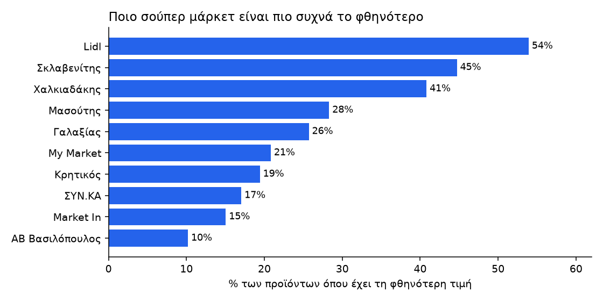
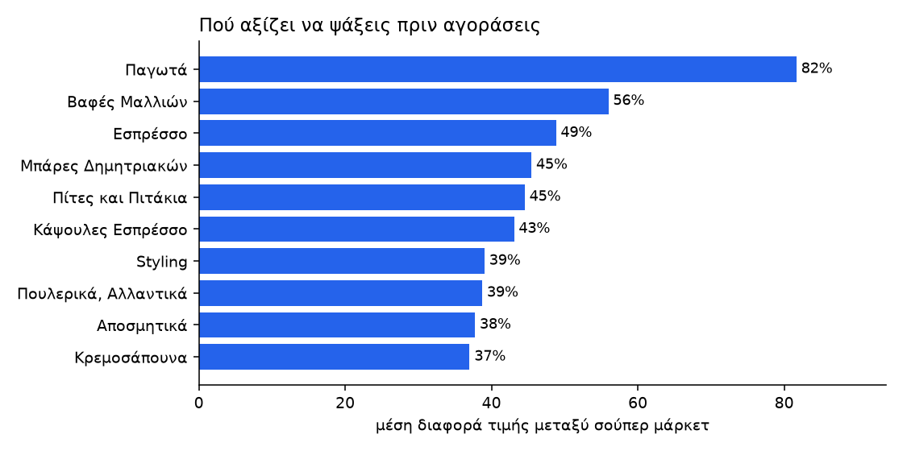
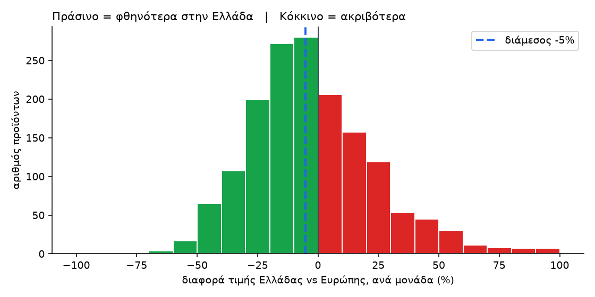

# 📊 Τι κρύβουν οι τιμές των σούπερ μάρκετ — 2026-06-23

Κάθε μέρα κατεβάζουμε ολόκληρο τον κατάλογο του Παρατηρητηρίου Τιμών (**8,550 προϊόντα** από **10 ελληνικά σούπερ μάρκετ**) και ψάχνουμε τις πιο ενδιαφέρουσες ιστορίες που κρύβονται στους αριθμούς. Να τι βρήκαμε σήμερα.

_Οι συγκρίσεις μεταξύ σούπερ μάρκετ αφορούν μόνο ελληνικές αλυσίδες και έχουν καθαριστεί από λάθη του Παρατηρητηρίου (τιμές μονάδας λανθασμένα συνδεδεμένες με πολυσυσκευασίες). Τα ονόματα των σούπερ μάρκετ είναι σύνδεσμοι προς το site τους._

## 🥇 Το ίδιο προϊόν, εντελώς διαφορετική τιμή

Το ίδιο ακριβώς προϊόν μπορεί να κοστίζει **3.5 φορές** περισσότερο — ανάλογα με το πού θα ψωνίσεις. Πρωταθλητής σήμερα: **ΚΡΙ ΚΡΙ Heartmade Οικογενειακό Παγωτό Βανίλια Κακάο Φράουλα 1,5kg (3lt)**, που πουλιέται **€3.99** στο [Lidl](https://www.lidl-hellas.gr) αλλά **€14.12** στο ΣΥΝ.ΚΑ — διαφορά **+254%** για το πανομοιότυπο προϊόν. Πριν το βάλεις στο καλάθι, αξίζει μια ματιά στην ετικέτα:

| Προϊόν | Φθηνότερα | Ακριβότερα | Διαφορά |
|---|---|---|---|
| ΚΡΙ ΚΡΙ Heartmade Οικογενειακό Παγωτό Βανίλια Κακάο Φράουλα 1,5kg (3lt) | €3.99 [Lidl](https://www.lidl-hellas.gr) | €14.12 ΣΥΝ.ΚΑ | **+254%** |
| FLOWERS Ελληνικά Κελλάρια Λευκός Οίνος Μοσχοφίλερο ΠΟΠ Μαντίνεια 750ml | €2.99 [Lidl](https://www.lidl-hellas.gr) | €8.57 [Κρητικός](https://www.kritikos-sm.gr) | **+187%** |
| ΔΩΔΩΝΗ Γιαούρτι Κλασικό 2% Λιπαρά 2x200gr | €1.21 [Γαλαξίας](https://www.5ae.gr) | €3.46 [Market In](https://www.market-in.gr) | **+186%** |
| Πατάτες MCCAIN Tradition Vegan 1kg | €1.70 [Χαλκιαδάκης](https://www.xalkiadakis.gr) | €4.59 [ΑΒ Βασιλόπουλος](https://www.ab.gr) | **+170%** |
| McCAIN  Πατάτες Chef Gourmet Κατεψυγμένες 500g | €1.50 [Χαλκιαδάκης](https://www.xalkiadakis.gr) | €3.99 [ΑΒ Βασιλόπουλος](https://www.ab.gr) | **+166%** |
| MCCAIN  Onion Rings Ροδέλες Κρεμμυδιού 350g | €1.58 [Χαλκιαδάκης](https://www.xalkiadakis.gr) | €4.10 [Κρητικός](https://www.kritikos-sm.gr) | **+159%** |
| TEZA Liquid Solution Εντομοαπωθητικό Υγρό Ανταλλακτικό για 120 Νύχτες 2X50ml | €2.15 [Σκλαβενίτης](https://www.sklavenitis.gr) | €5.39 [Γαλαξίας](https://www.5ae.gr) | **+151%** |
| EXCELLENCE Creme Βαφή Μαλλιών Νo9 Ξανθό Πολύ Ανοιχτό 48ml | €4.79 [Lidl](https://www.lidl-hellas.gr) | €11.98 [Μασούτης](https://www.masoutis.gr) | **+150%** |
| EXCELLENCE Creme Βαφή Μαλλιών Νo7.1 Ξανθό Σαντρέ 48ml | €4.79 [Lidl](https://www.lidl-hellas.gr) | €11.98 [Κρητικός](https://www.kritikos-sm.gr) | **+150%** |
| EXCELLENCE Creme Βαφή Μαλλιών Νo10.21 Κατάξανθο Ψυχρό Σαντρέ 48ml | €4.79 [Lidl](https://www.lidl-hellas.gr) | €11.98 [Μασούτης](https://www.masoutis.gr) | **+150%** |

## 🏆 Ποιο σούπερ μάρκετ είναι το φθηνότερο;

Συγκρίναμε **5,880** προϊόντα που πωλούνται σε τουλάχιστον δύο ελληνικές αλυσίδες. Πιο συχνά φθηνότερο βγαίνει το **Lidl** (έχει την καλύτερη τιμή στο 54% των περιπτώσεων), ενώ στο **ΑΒ Βασιλόπουλος** πληρώνεις κατά μέσο όρο **+20%** παραπάνω σε σχέση με το να αγόραζες κάθε προϊόν εκεί που έχει την πιο χαμηλή τιμή. Ολόκληρη η κατάταξη:

| Σούπερ μάρκετ | Φορές φθηνότερο | Μέση επιβάρυνση vs φθηνότερου |
|---|---|---|
| [Lidl](https://www.lidl-hellas.gr) | 54% | +8% |
| [Σκλαβενίτης](https://www.sklavenitis.gr) | 45% | +9% |
| [Χαλκιαδάκης](https://www.xalkiadakis.gr) | 41% | +11% |
| [Μασούτης](https://www.masoutis.gr) | 28% | +18% |
| [Γαλαξίας](https://www.5ae.gr) | 26% | +18% |
| [My Market](https://www.mymarket.gr) | 21% | +16% |
| [Κρητικός](https://www.kritikos-sm.gr) | 19% | +19% |
| ΣΥΝ.ΚΑ | 17% | +19% |
| [Market In](https://www.market-in.gr) | 15% | +19% |
| [ΑΒ Βασιλόπουλος](https://www.ab.gr) | 10% | +20% |

## 🛒 Πού αξίζει να ψάξεις πριν αγοράσεις

Σε κάποιες κατηγορίες η τιμή για το ίδιο πράγμα αλλάζει δραματικά από μαγαζί σε μαγαζί — εκεί η σύγκριση σε ανταμείβει περισσότερο. Πρωταθλητές τα **Παγωτά**, όπου η μέση διαφορά τιμής αγγίζει το **88%**. Οι κατηγορίες όπου το ψάξιμο πληρώνει:

| Κατηγορία | Μέση διαφορά μεταξύ μαγαζιών | Προϊόντα |
|---|---|---|
| Παγωτά | 88% | 45 |
| Πίτες και Πιτάκια | 50% | 55 |
| Μπάρες Δημητριακών | 45% | 49 |
| Κάψουλες Εσπρέσσο | 45% | 56 |
| Βαφές Μαλλιών | 44% | 108 |
| Εσπρέσσο | 42% | 36 |
| Αποσμητικά | 40% | 62 |
| Πουλερικά, Αλλαντικά | 38% | 55 |
| Styling | 37% | 91 |
| Εντομοκτόνα, Εντομοαπωθητικά | 36% | 112 |

## 🏷️ Επώνυμο ή προϊόν ιδιωτικής ετικέτας;

Τα προϊόντα ιδιωτικής ετικέτας (της ίδιας της αλυσίδας) κοστίζουν σταθερά πολύ λιγότερο από τα επώνυμα. Η μεγαλύτερη διαφορά είναι στην κατηγορία **Γάτα**, όπου γλιτώνεις έως και **75%** ανά μονάδα. Πού συμφέρει περισσότερο το προϊόν του σούπερ μάρκετ:

| Κατηγορία | Ιδιωτική ετικέτα | Επώνυμο | Γλιτώνεις |
|---|---|---|---|
| Γάτα | €1.98/μον. | €7.77/μον. | **75%** |
| Κρασί | €2.04/μον. | €6.72/μον. | **70%** |
| Styling | €7.22/μον. | €21.60/μον. | **67%** |
| Σκύλος | €1.42/μον. | €4.00/μον. | **64%** |
| Μακρύκοκο Ρύζι | €1.56/μον. | €4.37/μον. | **64%** |
| Μαρμελάδα | €3.90/μον. | €10.40/μον. | **62%** |
| Μπισκότα | €3.70/μον. | €9.72/μον. | **62%** |
| Χλωρίνη | €0.80/μον. | €2.07/μον. | **62%** |
| Αλεύρι | €0.66/μον. | €1.68/μον. | **61%** |
| Παγωμένο Τσάι | €1.16/μον. | €2.71/μον. | **57%** |

## 🇬🇷🇪🇺 Η Ελλάδα φθηνότερη ή ακριβότερη από την Ευρώπη;

Βρήκαμε **1,586** προϊόντα που πωλούνται και στην Ελλάδα και σε άλλες ευρωπαϊκές αλυσίδες, και συγκρίναμε την τιμή τους **ανά μονάδα** (ανά κιλό ή λίτρο, ώστε οι διαφορετικές συσκευασίες να είναι συγκρίσιμες).

Από αυτά, τα **883 (56%) είναι φθηνότερα** στην Ελλάδα και τα **592 (37%) ακριβότερα**· το υπόλοιπο 7% έχει ουσιαστικά ίδια τιμή. Συνολικά η Ελλάδα βγαίνει ελαφρώς φθηνότερη — η διάμεση διαφορά είναι **-5%** σε σχέση με την Ευρώπη. Οι ακρότητες όμως είναι έντονες: **392 προϊόντα (25%)** είναι πάνω από 20% φθηνότερα εδώ, ενώ **280 (18%)** πάνω από 20% ακριβότερα.

**Πολύ φθηνότερα στην Ελλάδα:**

| Προϊόν | Ελλάδα | Ευρώπη | Διαφορά |
|---|---|---|---|
| JOHNSON  Αφρόλουτρο Άνθη Ροδιάς 750ml | €3.05/L | €8.77/L | **-65%** |
| PARODONTAX Στοματικό Διάλυμα Active Gum Health Extra Fresh 500ml | €7.72/L | €22.18/L | **-65%** |
| DOVE Αφρόλουτρο Men+Care Extra Fresh 400ml | €5.20/L | €14.30/L | **-64%** |
| DOVE Αφρόλουτρο Advanced Care Nourishing Care 600ml | €4.82/L | €12.15/L | **-60%** |
| DOVE  Αφρόλουτρο Anti Stress 600ml | €5.07/L | €12.15/L | **-58%** |
| DOVE  Αφρόλουτρο Deeply Nourishing 600ml | €5.07/L | €12.15/L | **-58%** |

**Πολύ ακριβότερα στην Ελλάδα:**

| Προϊόν | Ελλάδα | Ευρώπη | Διαφορά |
|---|---|---|---|
| NESTLE Φρουτοπουρές Μήλο Μπανάνα Βρώμη 90gr | €18.11/kg | €6.56/kg | **+176%** |
| HARIBO Tropifrutti Ζελεδάκια 175g | €14.09/kg | €6.80/kg | **+107%** |
| HARIBO Pasta Frutta Ζελεδάκια 160g | €15.41/kg | €7.44/kg | **+107%** |
| KNORR Ζωμός Λαχανικών Vegan 6 κύβοι 60g | €23.00/kg | €11.17/kg | **+106%** |
| AUTAN Εντομοαπωθητικό Σπρέι Family Care 100ml | €81.80/L | €40.10/L | **+104%** |
| ΟΛΥΜΠΟΣ Ice Tea Green Φράουλα Δυόσμος Ιβίσκος Χωρίς ζάχαρη 500ml | €3.00/L | €1.52/L | **+97%** |

## 🔗 Έλεγξε τις τιμές μόνος σου

Τα ονόματα των σούπερ μάρκετ στους πίνακες είναι σύνδεσμοι προς το site της κάθε αλυσίδας — άνοιξέ τα και ψάξε το προϊόν με το όνομά του για να επιβεβαιώσεις την τιμή. Επίσημη πηγή των δεδομένων είναι το **[Παρατηρητήριο Τιμών — posokanei.gov.gr](https://posokanei.gov.gr)**, όπου βλέπεις την τιμή κάθε προϊόντος σε όλες τις αλυσίδες μαζί.

| Σούπερ μάρκετ | Ιστοσελίδα |
|---|---|
| Lidl | [https://www.lidl-hellas.gr](https://www.lidl-hellas.gr) |
| Market In | [https://www.market-in.gr](https://www.market-in.gr) |
| My Market | [https://www.mymarket.gr](https://www.mymarket.gr) |
| ΑΒ Βασιλόπουλος | [https://www.ab.gr](https://www.ab.gr) |
| Γαλαξίας | [https://www.5ae.gr](https://www.5ae.gr) |
| Κρητικός | [https://www.kritikos-sm.gr](https://www.kritikos-sm.gr) |
| Μασούτης | [https://www.masoutis.gr](https://www.masoutis.gr) |
| ΣΥΝ.ΚΑ | — |
| Σκλαβενίτης | [https://www.sklavenitis.gr](https://www.sklavenitis.gr) |
| Χαλκιαδάκης | [https://www.xalkiadakis.gr](https://www.xalkiadakis.gr) |
